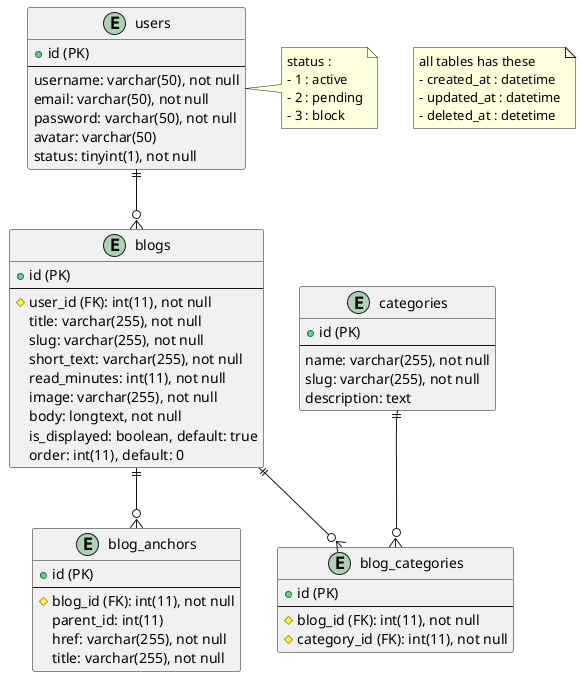

## Build Project
1. cp .env.example .env
- file .env
```
# App
APP_NAME=webrtc
APP_PORT=3001
APP_HOST=localhost
APP_DEBUG_PORT=9229
APP_ENV=development

ALLOW_ORIGIN=*

# MYSQL CONFIG
DB_HOST=webrtc_database
DB_PORT=3306
DB_DATABASE=webrtc
DB_USERNAME=docker
DB_PASSWORD=password
DB_DIALECT=mysql
DB_POOL_MAX=5
DB_POOL_MIN=0
DB_POOL_ACQUIRE=30000
DB_POOL_IDLE=10000
DB_LOGGING=true
DB_SYNC=false

FORWARD_DB_PORT=3307

SALT_ROUND=1

# MAIL CONFIG
MAIL_HOST=
MAIL_PORT=
MAIL_USER=
MAIL_PASS=
MAIL_FROM=

URL_FRONT=
```
2. sudo chmod -R 777 .
3. docker compose build --no-cache
4. docker compose up -d
5. docker exec -it webrtc_app bash
6. npm install

Portfolio Database
===

